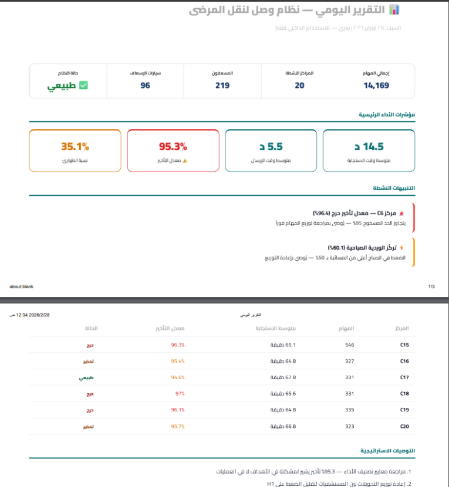

<div align="center">


# Wasl — وصل
### *Patient Transfer Intelligence Platform for Saudi Arabia's Healthcare Sector*

<br/>

[](https://moha-111.github.io/Medical-Transport-Operations-Analytics/)
[](CHANGELOG.md)
[](LICENSE)
[](https://github.com/Moha-111/Medical-Transport-Operations-Analytics/actions)

<br/>

[](https://moha-111.github.io/Medical-Transport-Operations-Analytics/)
[](https://moha-111.github.io/Medical-Transport-Operations-Analytics/)
[](https://moha-111.github.io/Medical-Transport-Operations-Analytics/)
[](https://moha-111.github.io/Medical-Transport-Operations-Analytics/)

<br/>

[](https://moha-111.github.io/Medical-Transport-Operations-Analytics/)
[](https://moha-111.github.io/Medical-Transport-Operations-Analytics/)
[](https://moha-111.github.io/Medical-Transport-Operations-Analytics/)
[](SECURITY.md)

</div>

---

## Table of Contents

- [Overview](#-overview)
- [Live Demo](#-live-demo)
- [Key Metrics](#-key-metrics)
- [Platform Modules](#-platform-modules)
- [Automation Pipeline](#-automation-pipeline--live)
- [Architecture](#-architecture)
- [Market Opportunity](#-market-opportunity)
- [Deployment Scenarios](#-deployment-scenarios)
- [Business Model](#-business-model)
- [Getting Started](#-getting-started)
- [Contributing](#-contributing)
- [Roadmap](#-roadmap)
- [Security & Privacy](#-security--privacy)
- [Contact](#-contact)

---

## 📌 Overview

**Wasl (وصل)** — Arabic for *"to connect"* — is an operational intelligence platform engineered for private hospitals, EMS networks, and government health clusters to monitor, analyze, and optimize patient transfer operations in real time.

Built on **14,169 real-world-scale transfer missions**, Wasl consolidates what was previously scattered across Excel sheets, WhatsApp groups, and manual reports into a single, AI-powered intelligence layer.

> **Wasl connects patients to hospitals. It connects decisions to data.**

### What Makes Wasl Different

| Challenge Before Wasl | How Wasl Solves It |
|----------------------|-------------------|
| No unified visibility across centers | Centralized dashboard for 20+ centers |
| Manual reports taking 28 hours/week | Automated AI reports every morning at 7 AM |
| No benchmark for paramedic efficiency | Individual KPI tracking for 219+ paramedics |
| Reactive management (after incidents) | Proactive alerts before KPI thresholds breach |
| Delayed decision-making | Real-time monitoring with 5-second refresh |

---

## 🌐 Live Demo

<div align="center">

### [→ Launch Wasl Platform](https://moha-111.github.io/Medical-Transport-Operations-Analytics/)

*No installation required. Runs in any modern browser. PWA-installable on mobile.*

**Demo Credentials:**

| Role | Username | Password | Access Level |
|------|----------|----------|-------------|
| 🔴 Admin | `admin` | `admin123` | Full platform |
| 🔵 Manager | `manager` | `mgr123` | Center-level data |
| 🟢 Dispatcher | `dispatch` | `dis123` | Active missions |

</div>

---

## 📊 Key Metrics

<div align="center">

| KPI | Value | Target | Status |
|-----|-------|--------|--------|
| Total Missions Analyzed | **14,169** | — | ✅ |
| Avg Response Time | **14.5 min** | ≤ 15 min | ✅ On Target |
| Avg Dispatch Time | **5.5 min** | ≤ 8 min | ✅ Excellent |
| Mission Duration | **132.9 min** | — | 📊 Tracked |
| Emergency (Life-Saving) Rate | **35.1%** | — | 🚨 Monitored |
| Late Dispatch Rate | **95.3%** | ≤ 95% | ⚠️ Near Limit |
| H1 Hospital Share | **72.1%** | Balanced | ⚠️ Imbalanced |
| Centers Under Monitoring | **20** | 20 | ✅ Full Coverage |
| Paramedics Tracked | **219** | — | ✅ |
| Reports Auto-Generated/Year | **365** | 365 | ✅ LIVE |

</div>

---

## 🖥️ Platform Modules

```
🚑 Wasl Integrated Platform v1.3.0
│
├── 📊  Main Dashboard        → KPIs, trend charts, center rankings
├── 📡  Live Monitoring       → Real-time feed, 5s refresh, event log
├── 🗂️  Mission Registry      → 14,169 missions + search, filter, export
├── ➕  Data Entry            → Manual form + Excel (.xlsx) import
├── 🏢  Center Management     → 20 centers, progress bars, benchmarks
├── 👨‍⚕️ Paramedic Management  → 219 profiles, individual KPIs, status
├── 📄  Automated Reports     → PDF export + Make.com scheduling
├── 🔔  Alert System          → Configurable KPI threshold alerts
├── 📈  ROI Impact Analysis   → Before/after metrics, savings calculator
└── ⚙️  Settings              → KPI limits, webhook config, preferences
```

### Automated Daily Report

<div align="center">


*📧 Actual email — GPT-4o generated Arabic operations report, delivered at 7:00 AM daily*

</div>

---

## 🤖 Automation Pipeline — LIVE ✅

Wasl runs a fully automated AI reporting pipeline **365 days a year with zero manual intervention**:

```
7:00 AM Riyadh Time (daily)
        │
        ▼
  Make.com Triggers
        │
        ▼
  GPT-4o Analyzes KPIs
  ┌─────────────────────────────────────┐
  │ • Performance vs. targets           │
  │ • Anomaly detection                 │
  │ • Center rankings                   │
  │ • Actionable recommendations        │
  └─────────────────────────────────────┘
        │
        ▼
  Professional Arabic Report Generated
        │
        ▼
  Gmail API → Operations Team Inbox
```

| Component | Technology | Status |
|-----------|-----------|--------|
| Scheduler | Make.com | ✅ LIVE |
| AI Analysis | OpenAI GPT-4o | ✅ LIVE |
| Report Language | Arabic (RTL) | ✅ LIVE |
| Email Delivery | Gmail API | ✅ LIVE |
| Frequency | Daily at 7:00 AM | ✅ 365 days/year |

---

## 🏗️ Architecture

```
┌─────────────────────────────────────────────────────┐
│                    Data Layer                        │
│     Excel (.xlsx) → 14,169 records × 25 columns     │
└───────────────────────┬─────────────────────────────┘
                        │
┌───────────────────────▼─────────────────────────────┐
│                  Analytics Layer                     │
│        KPIs · Aggregations · Trend Analysis          │
└──────────┬────────────────────────┬─────────────────┘
           │                        │
┌──────────▼──────────┐   ┌─────────▼──────────────────┐
│   Wasl SPA          │   │   Make.com Automation       │
│   HTML/JS/CSS       │   │   OpenAI GPT-4o + Gmail     │
│   PWA + Offline     │   │   Daily 7AM Arabic Report   │
│   GitHub Pages      │   │                             │
└─────────────────────┘   └────────────────────────────┘
```

### Tech Stack

| Layer | Technology | Purpose |
|-------|-----------|---------|
| **Frontend** | HTML5 + CSS3 + Vanilla JS | Zero-dependency SPA |
| **Charts** | Chart.js 4.4.0 (CDN) | Interactive visualizations |
| **Fonts** | Cairo + JetBrains Mono | Arabic + monospace UI |
| **Data** | Microsoft Excel (.xlsx) | Operational data store |
| **Automation** ✅ | Make.com + OpenAI GPT-4o | Daily AI reports |
| **Delivery** ✅ | Gmail API | Automated email |
| **Hosting** | GitHub Pages + Actions | CI/CD + CDN |
| **PWA** | Service Worker + manifest.json | Offline + installable |
| **AI Dev** | Claude AI (Vibe Coding) | AI-first development |

Full architecture: [docs/ARCHITECTURE.md](docs/ARCHITECTURE.md) · Deployment guide: [docs/DEPLOYMENT.md](docs/DEPLOYMENT.md)

---

## 📈 Market Opportunity

```
🏥  450+   Private hospitals in Saudi Arabia
🏢  2,000+ Specialized clinics
🚑  30+    Medical transport companies
👥  37M    Population served
📈  $4.2B  Saudi healthcare IT market by 2030
🎯  Vision 2030 Digital Health — priority sector
```

---

## 🗺️ Deployment Scenarios

Wasl was designed for **five high-impact deployment targets**, each validated by real EMS operational experience:

### 🏥 1. Hospital Transport Departments
> *Private and semi-government hospitals with internal patient transfer fleets*

**Pain:** Fragmented data, manual reporting, no real-time visibility across shifts
**Value:** Live dashboard + daily AI reports + instant threshold alerts
**ROI:** Replaces 28 hrs/week of manual work with 3 hrs

### 🚑 2. EMS Networks & Regional Operations Centers
> *Multi-center emergency medical services networks (20+ centers, 200+ paramedics)*

**Pain:** No unified view, manual KPI tracking, no predictive alerts
**Value:** Center benchmarking, paramedic productivity tracking, peak-hour surge alerts
**Why Wasl:** Built on 14,169 real EMS-scale missions by a field EMS professional

### 🏛️ 3. Government Health Clusters
> *Ministry of Health clusters (e.g., First Health Cluster Riyadh — 20+ hospitals)*

**Pain:** No accountability chain for delays, manual inter-facility coordination
**Value:** Real-time governance layer, bottleneck detection
**Alignment:** Arabic-first UI + PDPL roadmap + Vision 2030 Digital Health

### 🚐 4. Private Ambulance Providers
> *Licensed private ambulance companies across Riyadh, Jeddah, Dammam*

**Pain:** No automated client reporting, no crew performance data
**Value:** Daily performance reports to clients + WhatsApp alerts
**ROI:** 500–1,500 SAR/month — immediate ROI vs. hiring an analyst

### 🕌 5. Hajj & Mass Gathering Medical Logistics
> *Ministry of Health EMS teams during Hajj, Umrah, and national events*

**Pain:** No centralized dashboard, cascading bottlenecks, paper post-event analysis
**Value:** Real-time multi-sector monitoring, instant alerts, scalable to 100+ centers
**Unique:** Arabic-first + Saudi operational context + mass gathering scalability

---

## 💼 Business Model

<div align="center">

| Plan | Target | Price | Key Features |
|------|--------|-------|--------------|
| 🔵 **Basic** | Small clinics | **500 SAR/month** | Dashboard + Reports + 1 Center |
| 🟡 **Pro** | Mid-size hospitals | **1,500 SAR/month** | + WhatsApp Alerts + AI Reports + 5 Centers |
| 🔴 **Enterprise** | Hospital chains | **Custom** | + Multi-branch + API + SLA + PDPL |

> **10 hospitals on Pro = 15,000 SAR/month recurring revenue**

</div>

### Why Wasl Wins

| Feature | Wasl | Legacy Systems |
|---------|------|----------------|
| Full Arabic RTL UI | ✅ Native | ❌ Rarely |
| AI-powered Arabic reports | ✅ GPT-4o daily | ❌ None |
| WhatsApp instant alerts | ✅ Roadmap | ❌ None |
| Time to deploy | ✅ Minutes | ❌ Months |
| Monthly cost | ✅ From 500 SAR | ❌ 50,000+ SAR |
| Offline capability | ✅ PWA | ❌ Cloud-only |
| Saudi PDPL compliance | ✅ Roadmap | ⚠️ Varies |

### Seeking Investment & Support

[](https://www.monshaat.gov.sa)
[](https://stv.vc)
[](https://flat6labs.com)
[](https://vision2030.gov.sa)

---

## 🚀 Getting Started

### Try the Live Platform

```
https://moha-111.github.io/Medical-Transport-Operations-Analytics/
```

### Run Locally

```bash
git clone https://github.com/Moha-111/Medical-Transport-Operations-Analytics.git
cd Medical-Transport-Operations-Analytics

# Method 1 — Direct (basic)
open index.html

# Method 2 — Local server (enables PWA + Service Worker)
python3 -m http.server 8080
# Visit: http://localhost:8080
```

### Install as Mobile App (PWA)

1. Open the platform in Chrome (Android) or Safari (iOS)
2. Tap menu → **"Add to Home Screen"** / **"Install App"**
3. Wasl launches as a native-like app — works offline

### Explore the Data (Python)

```python
import pandas as pd

df = pd.read_excel('Medical-Transport-Analytics.xlsx',
                   sheet_name='Daily Operations Data')

print(f"Total missions:    {len(df):,}")
print(f"Centers:           {df['Center Name'].nunique()}")
print(f"Paramedics:        {df['Paramedic Name'].nunique()}")
print(f"Avg response time: {df['Response Time (min)'].mean():.1f} min")
print(f"Emergency rate:    {(df['Referral Type']=='Life-Saving').mean()*100:.1f}%")
```

---

## 🤝 Contributing

| Type | Link |
|------|------|
| 🐛 Bug Reports | [Bug report template](.github/ISSUE_TEMPLATE/bug_report.yml) |
| ✨ Feature Requests | [Feature request template](.github/ISSUE_TEMPLATE/feature_request.yml) |
| 💻 Code Contributions | [CONTRIBUTING.md](CONTRIBUTING.md) |
| 🤝 Code of Conduct | [CODE_OF_CONDUCT.md](CODE_OF_CONDUCT.md) |

---

## 🗺️ Roadmap

```
NOW ✅              Q3 2026 🔵           Q1 2027 🟡           Q4 2027 🔴
────────────        ──────────────       ──────────────       ──────────────
v1.3.0              Pilot Program        Commercial           Full SaaS
PWA + Offline       Google Sheets DB     Launch               Multi-tenant
AI Reports LIVE     1 Hospital Free      WhatsApp Alerts      10+ Clients
CI/CD Pipeline      Real-time Sync       PWA App Store        MOH Certified
```

- [x] ✅ MVP Dashboard + KPI analytics
- [x] ✅ Automated AI daily reports (Make.com + GPT-4o)
- [x] ✅ PWA + offline support (Service Worker)
- [x] ✅ CI/CD pipeline (GitHub Actions)
- [x] ✅ Professional documentation + security policy
- [ ] 🔵 Google Sheets live database integration
- [ ] 🔵 First hospital pilot (free)
- [ ] 🟡 WhatsApp instant KPI alerts
- [ ] 🟡 Company registration + Monsha'at application
- [ ] 🔴 Multi-hospital SaaS platform
- [ ] 🔴 Saudi MOH certification + PDPL compliance

---

## 🔒 Security & Privacy

All data in this repository is **synthetic/demo data. No real patient information is included.**

| Area | Status |
|------|--------|
| Responsible disclosure policy | ✅ [SECURITY.md](SECURITY.md) |
| PDPL compliance roadmap | ✅ Documented |
| No real patient data | ✅ Verified |
| No hardcoded credentials | ✅ Verified |
| Automated security scanning | ✅ GitHub Actions CI |

Report vulnerabilities: [GitHub Security Advisories](https://github.com/Moha-111/Medical-Transport-Operations-Analytics/security/advisories/new)

---

## 📂 Documentation

| Document | Description |
|----------|-------------|
| [docs/ARCHITECTURE.md](docs/ARCHITECTURE.md) | System design, data flow, component map |
| [docs/DEPLOYMENT.md](docs/DEPLOYMENT.md) | Hosting, CI/CD, Make.com setup |
| [docs/DATA_DICTIONARY.md](docs/DATA_DICTIONARY.md) | Field definitions, KPI formulas |
| [CHANGELOG.md](CHANGELOG.md) | Version history |
| [CONTRIBUTING.md](CONTRIBUTING.md) | Contributor guidelines |
| [SECURITY.md](SECURITY.md) | Security policy & PDPL roadmap |

### External Resources

[](https://docs.google.com/spreadsheets/d/1lFtHLgycKMlTFfpC4YbL_Dsvn2ZprOJARc1imcIBF0g/edit?usp=sharing)
[](https://docs.google.com/spreadsheets/d/1-ZUjvnIdeTTqLc3Z-nyYd8Csftds2e6l/edit?usp=sharing)

---

## 📬 Contact

<div align="center">

**Mohammad Alshehri — Builder of Wasl**
*EMS Professional · AI-first Developer · Healthcare Innovator*

[](https://linkedin.com/in/mohammad-alshehri-b0a579388)
[](https://github.com/Moha-111)

*For pilot programs, partnerships, and investment inquiries — connect on LinkedIn*

</div>

---

<div align="center">

**Built with ❤️ at Tuwaiq Hackathon · Powered by Claude AI (Vibe Coding)**

*Wasl v1.3.0 — Connecting Patients to Hospitals, and Decisions to Data*


</div>
